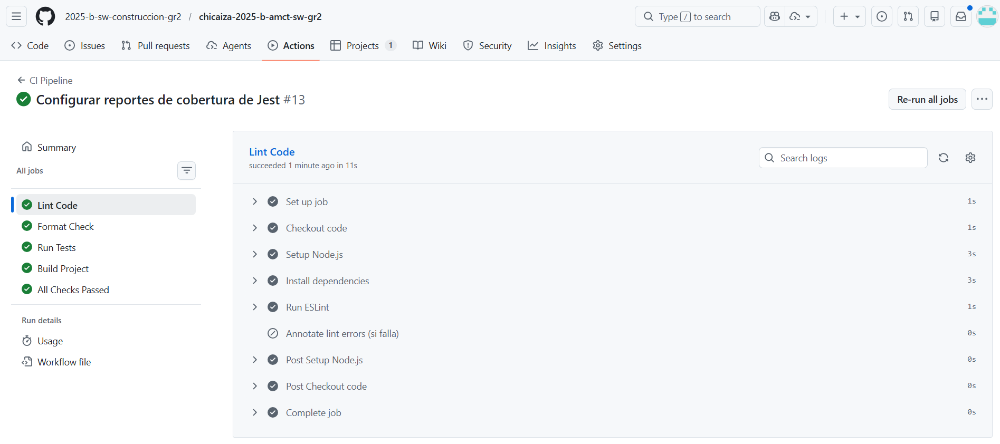
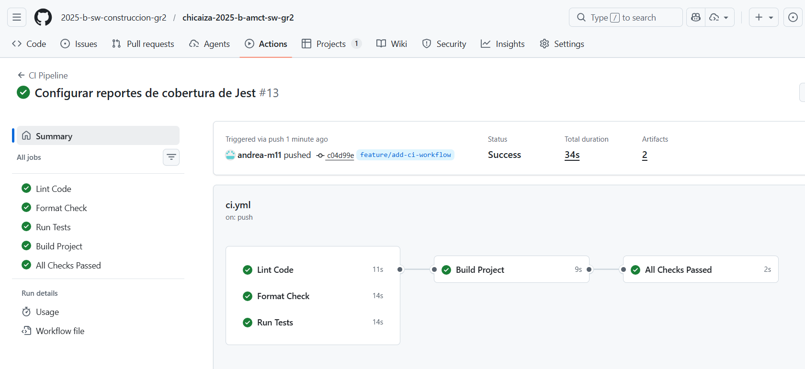
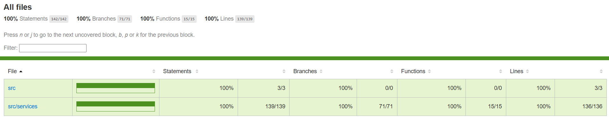
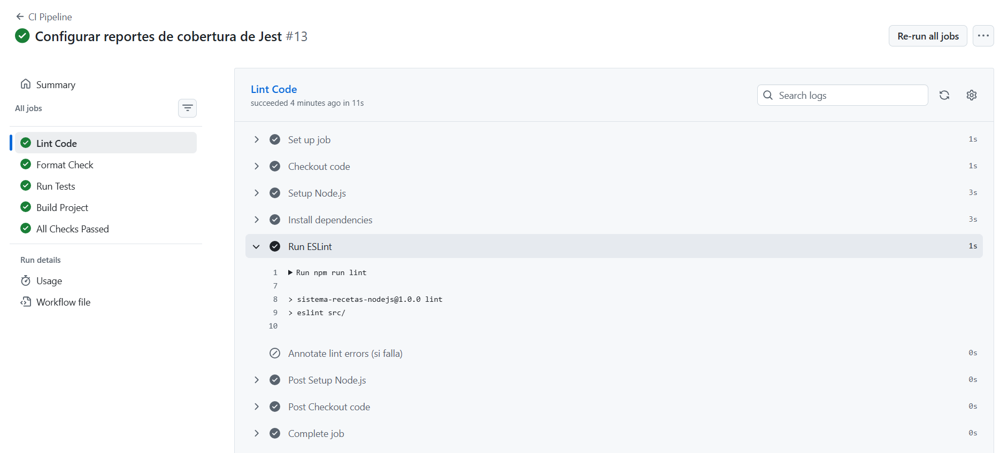
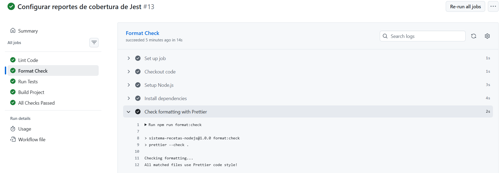
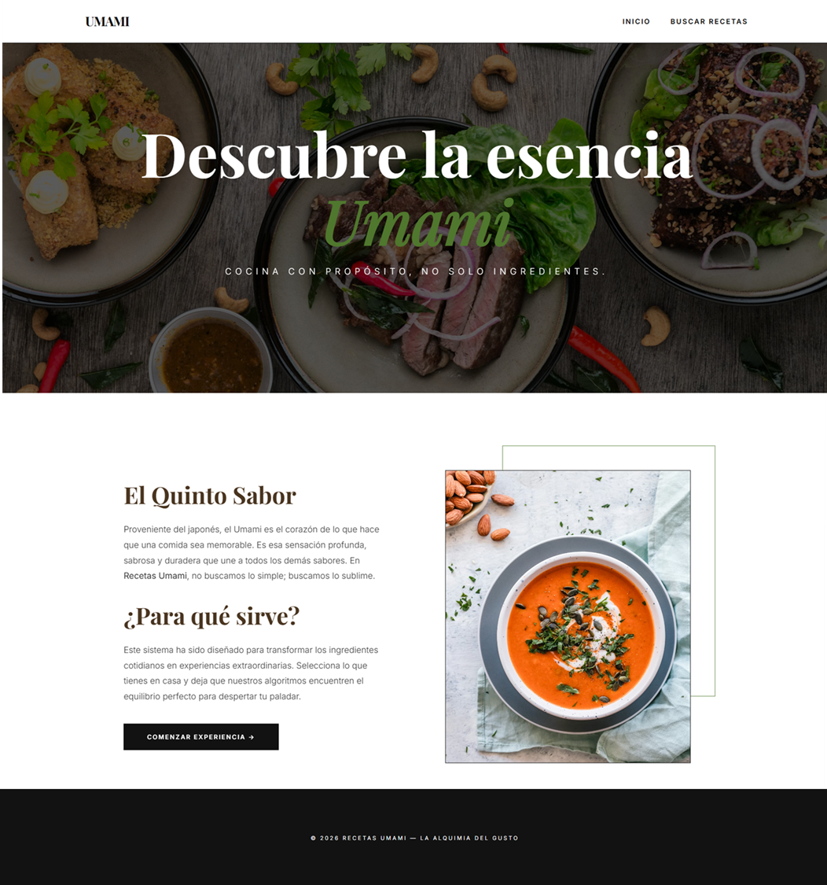
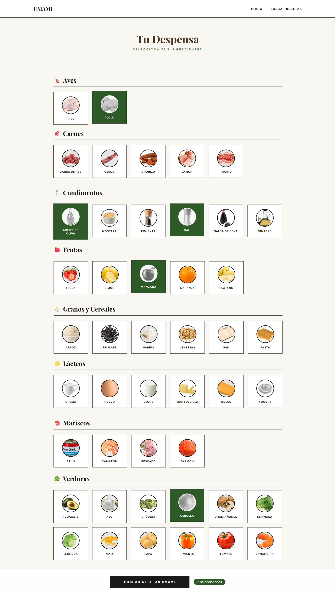
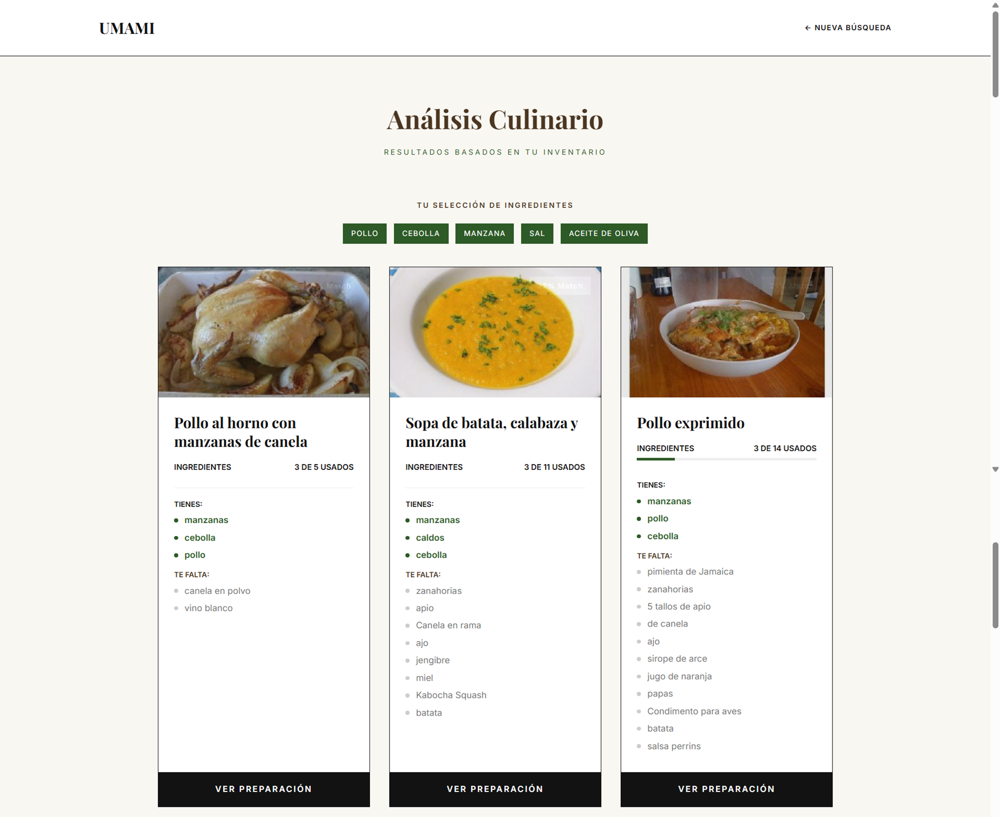
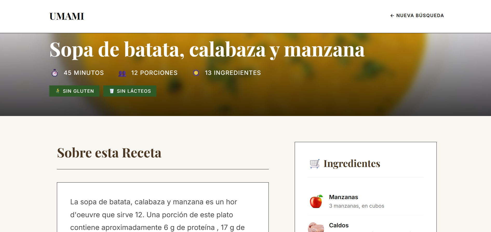

# 🍜 Umami - Sistema de Recetas (Node.js + Express)

**El Quinto Sabor** - Un sistema para descubrir recetas basadas en los ingredientes que tienes en casa.

## 📋 Descripción

Este proyecto usa Node.js con Express. Utiliza la API de Spoonacular para buscar recetas y la API de MyMemory para traducir los resultados al español.

## 🚀 Tecnologías Utilizadas

- **Node.js** - Entorno de ejecución JavaScript
- **Express** - Framework web minimalista
- **Sequelize** - ORM para Node.js
- **MySQL** - Base de datos relacional
- **EJS** - Motor de plantillas
- **Axios** - Cliente HTTP para APIs
- **dotenv** - Gestión de variables de entorno
- **Jest** - Framework de testing
- **ESLint** - Linter para análisis estático de código
- **Prettier** - Formateador de código

---

## 📁 Estructura del Proyecto

```
UnamiRecetas/
├── .github/
│   └── workflows/
│       └── ci.yml             # Pipeline de CI/CD
├── src/
│   ├── app.js                 # Punto de entrada de la aplicación
│   ├── config/
│   │   └── database.js        # Configuración de Sequelize/MySQL
│   ├── models/
│   │   ├── index.js           # Exporta todos los modelos
│   │   ├── Categoria.js       # Modelo de Categoría
│   │   └── Ingrediente.js     # Modelo de Ingrediente
│   ├── routes/
│   │   └── index.js           # Definición de rutas
│   ├── services/
│   │   ├── ingredienteService.js   # Lógica de negocio para ingredientes
│   │   ├── spoonacularClient.js    # Cliente para API Spoonacular
│   │   └── traductorService.js     # Servicio de traducción
│   ├── views/
│   │   ├── inicio.ejs              # Página de inicio
│   │   ├── ingredientes.ejs        # Selección de ingredientes
│   │   ├── recetas.ejs             # Resultados de búsqueda
│   │   └── receta-detalle.ejs      # Detalle de receta
│   └── __tests__/                  # Pruebas unitarias
│       ├── ingredienteService.test.js
│       ├── spoonacularService.test.js
│       └── traductorService.test.js
├── coverage/                  # Reportes de cobertura (generado)
├── sql/
│   └── init.sql               # Script de inicialización de BD
├── .env                       # Variables de entorno (no en Git)
├── .gitignore                 # Archivos ignorados
├── .prettierrc                # Configuración de Prettier
├── eslint.config.js           # Configuración de ESLint
├── package.json               # Dependencias y scripts
└── README.md                  # Archivo de información
```

---

## ⚙️ Requisitos Previos

1. **Node.js** (v18 o superior, recomendado v20)
2. **MySQL** (v8.0 o superior)
3. **npm** (incluido con Node.js)
4. **Git** (para clonar el repositorio)

---

## 🔧 Cómo Correr el Proyecto Localmente

### 1. Clonar el repositorio

```bash
git clone https://github.com/tu-usuario/chicaiza-2025-b-amct-sw-gr2.git

cd chicaiza-2025-b-amct-sw-gr2/Examen_002/UnamiRecetas
```

### 2. Instalar dependencias

```bash
npm install
```

### 3. Configurar la base de datos

Ejecutar el script SQL para crear la base de datos y tablas:

```bash
mysql -u root -p < sql/init.sql
```

### 4. Configurar variables de entorno

Edita el archivo `.env` con tus credenciales:

```env
DB_HOST=localhost
DB_USER=root
DB_PASSWORD=tu_password
DB_NAME=umami_recetas
SPOONACULAR_API_KEY=tu_api_key
```

> **Nota:** Por motivos académicos, se incluyen valores por defecto en el archivo `.env`.

### 5. Ejecutar la aplicación

```bash
# Modo desarrollo (con hot reload usando nodemon)
npm run dev

# Modo producción
npm start
```

### 6. Abrir en el navegador

```
http://localhost:3000
```

### 7. Comandos disponibles

| Comando              | Descripción                                    |
| -------------------- | ---------------------------------------------- |
| `npm start`          | Inicia la aplicación en modo producción        |
| `npm run dev`        | Inicia con nodemon (hot reload)                |
| `npm run lint`       | Ejecuta ESLint para análisis de código         |
| `npm run format`     | Formatea el código con Prettier                |
| `npm run format:check` | Verifica el formato sin modificar archivos   |
| `npm test`           | Ejecuta las pruebas con Jest y genera cobertura |
| `npm run build`      | Genera el build del proyecto en `/dist`        |

---

## 🔄 Pipeline de CI/CD con GitHub Actions

Se implementó un pipeline de Integración Continua utilizando **GitHub Actions** ubicado en `.github/workflows/ci.yml`.

### ¿Qué valida el Pipeline?

El pipeline se ejecuta automáticamente en cada **push** y **pull request** hacia las ramas `main`, `develop` y `feature/**`. Valida los siguientes pasos **en orden**:

```
┌─────────────────────────────────────────────────────────────────┐
│                    🚀 CI Pipeline                               │
├─────────────────────────────────────────────────────────────────┤
│                                                                 │
│   ┌─────────┐    ┌──────────┐    ┌─────────┐                   │
│   │  Lint   │    │  Format  │    │  Tests  │   (En paralelo)   │
│   │ ESLint  │    │ Prettier │    │  Jest   │                   │
│   └────┬────┘    └────┬─────┘    └────┬────┘                   │
│        │              │               │                         │
│        └──────────────┼───────────────┘                         │
│                       ▼                                         │
│               ┌──────────────┐                                  │
│               │    Build     │   (Depende de lint, format, test)│
│               │   npm build  │                                  │
│               └──────┬───────┘                                  │
│                      ▼                                          │
│              ┌───────────────┐                                  │
│              │ Status Check  │   (Gate final para merge)        │
│              └───────────────┘                                  │
│                                                                 │
└─────────────────────────────────────────────────────────────────┘
```

### Detalle de cada Job

| Job | Herramienta | Descripción |
|-----|-------------|-------------|
| **🔍 Lint** | ESLint | Análisis estático del código para detectar errores y malas prácticas |
| **✏️ Format** | Prettier | Verifica que el código siga el estilo definido en `.prettierrc` |
| **🧪 Tests** | Jest | Ejecuta pruebas unitarias y genera reporte de cobertura |
| **🏗️ Build** | npm | Compila el proyecto y genera artefactos en `/dist` |
| **🏁 Status Check** | - | Verifica que todos los jobs anteriores pasaron exitosamente |

### Características del Pipeline

- ✅ **Concurrencia**: Cancela ejecuciones anteriores si hay un nuevo push
- ✅ **Cache de dependencias**: Usa caché de npm para instalación más rápida
- ✅ **Cobertura**: Sube reportes a Codecov automáticamente
- ✅ **Artefactos**: Guarda reportes de cobertura y build por 14 días
- ✅ **Resumen**: Genera un resumen visual en cada PR

---

## 🌿 Flujo de Trabajo con Git (GitFlow)

### Estrategia de Ramas

| Rama | Propósito |
|------|-----------|
| `main` | Código en producción, estable |
| `develop` | Rama de integración, contiene el proyecto base |
| `feature/*` | Ramas para nuevas funcionalidades |

### Revisión de código
   - Se aprobó el Pull Request antes de fusionar
   - El pipeline de CI fue exitoso

1. **Merge a develop:**
   - Una vez aprobado, se fusiona el PR a `develop`

### Ramas Creadas

| Rama | Descripción |
|------|-------------|
| `develop` | Contiene el proyecto base inicial |
| `feature/add-ci-workflow` | Adición del CI workflow y configuración de linters/tests |

---

## 📸 Capturas de Ejecución Exitosa

### Pipeline de CI en GitHub Actions




### Ejecución de Tests con Cobertura



### Lint y Format Check



### Pull Request Aprobado


---

## 👩‍🍳 Uso de la Aplicación

A continuación se describe el flujo de uso de la aplicación Umami, desde el inicio hasta la visualización del detalle de una receta.

### Paso 1: Página de Inicio

Al acceder a `http://localhost:3000`, se muestra la página de bienvenida de Umami. Esta página presenta una breve introducción al sistema y un botón para comenzar la búsqueda de recetas.

**Acciones disponibles:**
- Hacer clic en el botón **"Comenzar experiencia"** en la página de inicio o desde la navegación en **"Buscar Recetas"** para ir a la selección de ingredientes



---

### Paso 2: Selección de Ingredientes

En esta pantalla se muestran todos los ingredientes disponibles, organizados por categorías (verduras, frutas, carnes, lácteos, etc.). El usuario puede seleccionar los ingredientes que tiene disponibles en casa.

**Acciones disponibles:**
- Marcar los ingredientes disponibles haciendo clic en cada uno
- Los ingredientes seleccionados se resaltan visualmente
- Una vez seleccionados los ingredientes deseados, hacer clic en el botón **"Buscar Recetas"**



---

### Paso 3: Resultados de Búsqueda de Recetas

Después de seleccionar los ingredientes y hacer clic en buscar, el sistema consulta la API de Spoonacular para encontrar recetas que coincidan con los ingredientes seleccionados. Los resultados se muestran traducidos al español gracias al servicio de traducción.

**Información mostrada:**
- Imagen de la receta
- Nombre de la receta (traducido al español)
- Porcentaje de coincidencia con los ingredientes seleccionados
- Etiquetas de dieta (vegetariano, vegano, sin gluten, etc.)
- Tiempo de preparación

**Acciones disponibles:**
- Hacer clic en una receta para ver su detalle completo
- Volver a la selección de ingredientes para modificar la búsqueda



---

### Paso 4: Detalle de la Receta

Al seleccionar una receta, se muestra una vista detallada con toda la información necesaria para prepararla.

**Información mostrada:**
- Imagen ampliada de la receta
- Nombre completo de la receta
- Tiempo de preparación y número de porciones
- Lista completa de ingredientes con cantidades
- Instrucciones paso a paso para la preparación
- Etiquetas de dieta y restricciones alimentarias
- Información nutricional (si está disponible)

**Acciones disponibles:**
- Volver a la lista de recetas
- Iniciar una nueva búsqueda



---

### Flujo Resumido

```
┌──────────────┐     ┌────────────────────┐     ┌─────────────────┐     ┌──────────────────┐
│    Inicio    │ ──► │ Seleccionar        │ ──► │ Ver Resultados  │ ──► │ Ver Detalle      │
│   (GET /)    │     │ Ingredientes       │     │ de Recetas      │     │ de Receta        │
│              │     │ (GET /ingredientes)│     │ (POST /recetas) │     │ (GET /receta?id) │
└──────────────┘     └────────────────────┘     └─────────────────┘     └──────────────────┘
```

---

## �📖 Rutas Disponibles

| Método | Ruta             | Descripción                     |
| ------ | ---------------- | ------------------------------- |
| GET    | `/`              | Página de inicio                |
| GET    | `/ingredientes`  | Selección de ingredientes       |
| POST   | `/recetas`       | Buscar recetas con ingredientes |
| GET    | `/receta?id=123` | Ver detalle de una receta       |

---

## 🔑 API Keys

### Spoonacular

- Registro en [Spoonacular](https://spoonacular.com/food-api)
- API Key gratuita
- Límite: 150 requests/día en plan gratuito

### MyMemory (Traducciones)

- No requiere API Key
- Límite: 5000 caracteres/día sin registro

---

## 🎨 Características

- ✅ Diseño elegante y minimalista
- ✅ Ingredientes organizados por categorías
- ✅ Búsqueda de recetas en tiempo real
- ✅ Traducción automática al español
- ✅ Indicador de coincidencia de ingredientes
- ✅ Detalle completo de recetas
- ✅ Etiquetas de dieta (vegetariano, vegano, sin gluten)
- ✅ Responsive design
- ✅ Pipeline de CI/CD automatizado
- ✅ Pruebas unitarias con cobertura
- ✅ Código limpio con ESLint y Prettier
